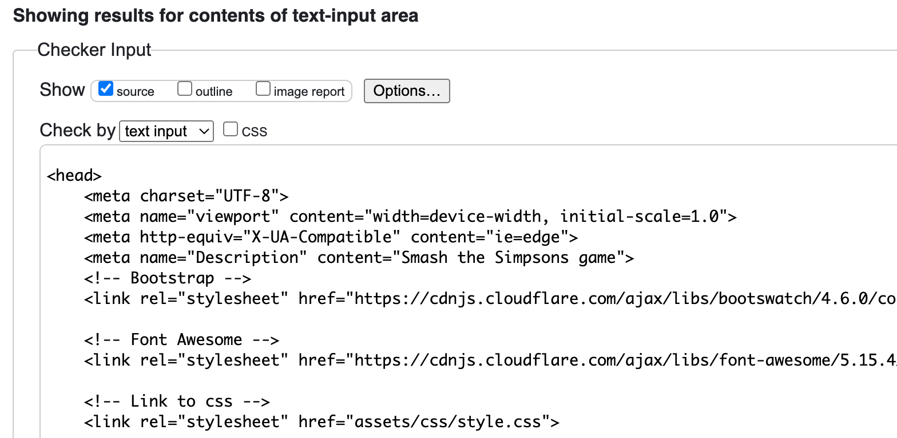
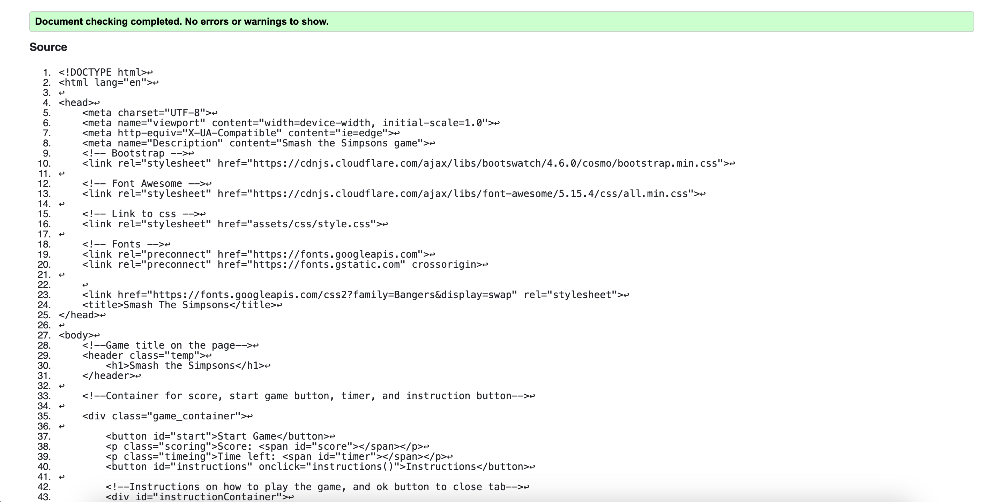
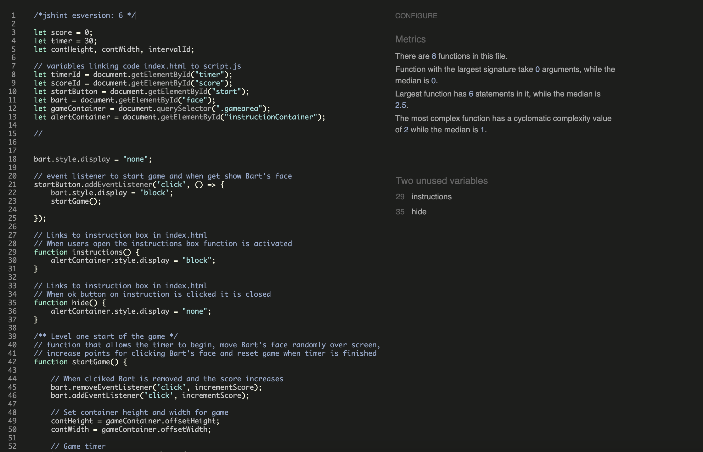

# Smash Simpsons

[Smash The Simpson](./assets/images/amiresponsive.png)

Smash the Simpsons is a game that is about hitting the Simpson characters in the face. It is a great game to pass the time 

Smash the Simpsons is an interactive web-based game where players aim to hit a moving image of the Simpson's face as it randomly appears in different positions on the screen. This engaging and fast-paced game tests players' reflexes and timing, offering a fun and humorous way to enjoy the beloved characters of the Simpsons series. The game makes for a great choice for quick entertainment and a lighthearted challenge for fans of the show and casual gamers alike.

Currently the game only lets you smash Bart Simpson in the face. The reason we have used Bart is of the is because he is the naughtiest Simpson. So we use Bart back as a way of getting back the 'naughty' Simpson. We know he gets on peoples nerves, so why not get him back for it. The age of the game would be for anyone from 13 to 55, but anyone of any age could pay as its quite easy to understand how to play and actually play. With its addictive gameplay and ever-changing challenges, players will want to come back to play more, as they try to beat their scores and improve their reaction times in this amusing and engaging game.

## Features

### Game title and game functions

Game functions include:

1. Start game button: which allows players to begin the game.
2. Instructions button - opens up the instructions pop up
3. Score - shows the player how many hits they have so far.
4. Timer - the timer shows how long the player has in the game.

[WebsiteHead](./assets/images/WebsiteHead.png)

### Target

The face of the character the player must click, to get a point. The target currently for the game is Bart's face.

### Background

This is the background of the whole game, which uses the image of the clousd from the Simspsons theme song.

### Instructions pop up

The instructon pop up box, explains how to play the game and the amount of time the player has.

### Future Implementations 

Currently the game has one level and you can only use one simpson character. In the future I am to add more levels, where level 2 there are more Simpsons characters but you only get a point for clicking Bart. Level two would be a kind of wheres Waldo level. In the future I would also allow players to choose the target they would like to hit.

## Testing

### Validator Testing

Testing on different devices has been done to text the responsitivity of the game. On smaller screen sizes the game functions have been shrunk to fit in the screen and still leave enough space for the game area for the target.

<!-- Screen size 1

Secreen size 2

Screen size 3  -->

###
A bug that had been recurring in the game was the score incrementing. The core would increment by 1 for the first round and 2 for the second and so on. The player was also able to still get points after the timer had finished. To fix this a score incrementing function was created, and a if statement was used in it. Along with adding and removing an event listener for the function incrementing score and then creating a new incrementing score.

Another bug that hda been faced was creating level two.

Lastly a bug that had to be fixed was the timer, the timer would continue decreasing past 0. So to fix this a new function was created outside the game and linked to in the intervalID.
HTML

* No errors were returned when passing through the official W3C validator CSS

* No errors were found when passing through the official (Jigsaw) validator

* JSHint had warned of two unused variables, however they were called in the index.html file. The codes it has been used in from the HTML file are referenced below:
  - <button id="ok" onclick="hide()">Ok</button>
  - <button id="instructions" onclick="instructions()">Instructions</button>

## Deployment

The webside was deployed through a hosting website called GitHub. To deploy:
1. Create a Github repository
2. Open on GitPod
3. Create game with Javascript, Html & CSS
4. Validated code had no errors 
5. Ran code on website by typing 'python3 -m http.server' in the Command Line
6. Any bugs were fixed and noted
7. Tested code on JSHint, W3Cvalidator 
8. All commits was pushed to GitHub
9. The setting tab in GitHub for the repository was clicked
10. Pages was clicked, then main Branch was clicked from the dropdown menu
11. The page was then saved and a live link was created

The live link to the website can be found here: 

## Credits

### Content

The structure for styling the instructions pop up was from a youtuber linked here: .

Part of the game set up had been used from the video linked below, however it was used as a starting reference, video link: 

### Media

The image for the background of the game was found and downloaded on Pinterest.
The image for Bart, the target, was found and downloaded from Pinterest
