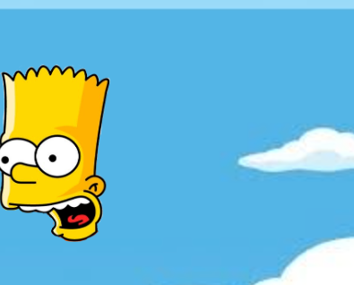
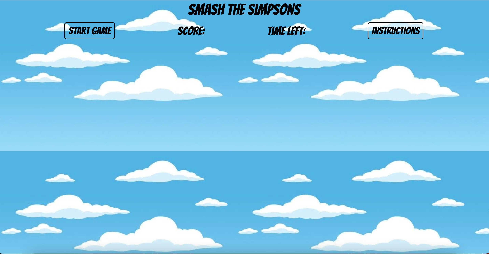
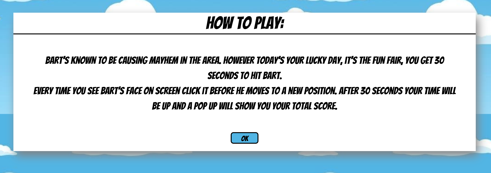

# Smash Simpsons

Smash the Simpsons is a game that is about hitting the Simpson characters in the face.
The game starts with the first level which is hitting a target as it moves around the screen.

The game uses javascript to have the targets and begin the game. HTML was used to crerate the structure and CSS to style and deign the game.

Currently the game has one level and you can only use one simpson character. In the future I am to add more levels, where level 2 there are more Simpsons characters but you only get a point for clicking Bart. Level two would be a kind of wheres Waldo level. In the future I would also allow players to choose the target they would like to hit.

## Features

### Game title and game functions

Game functions include:

1. Start game button: which allows players to begin the game.
2. Instructions button - opens up the instructions pop up
3. Score - shows the player how many hits they have so far.
4. Timer - the timer shows how long the player has in the game.

1[WebsiteHead](./assets/images/WebsiteHead.png)

### Target

The face of the character the player must click, to get a point. The target currently for the game is Bart's face.

### Background

This is the background of the whole game, which uses the image of the clousd from the Simspsons theme song.

### Instructions pop up

The instructon pop up box, explains how to play the game and the amount of time the player has.

## Testing

### Validator Testing

Testing on different devices has been tone to text the responsitivity of the game. On smaller screen sizes the game functions have been shrunk to fit in the screen and still leave enough space for the game area for the target.

A bug that had been recurring in the game was the score incrementing. The core would increment by 1 for the first round and 2 for the second and so on. The player was also able to still get points after the timer had finished. To fix this a score incrementing function was created, and a if statement was used in it. Along with adding and removing an event listener for the function incrementing score and then creating a new incrementing score.

Another bug that hda been faced was creating level two.

Lastly a bug that had to be fixed was the timer, the timer would continue decreasing past 0. So to fix this a new function was created outside the game and linked to in the intervalID.
HTML

* No errors were returned when passing through the official W3C validator
CSS
* No errors were found when passing through the official (Jigsaw) validator

## Deployment

The webside was deployed through a hosting website called GitHub. To deploy:

1. All commits was pushed to GitHub
2. The setting tab in GitHub for the repository was clicked
3. In the source section, the Master Branch was clicked from the dropdown menu
4. The page was then saved and created a live link

The live link to the website can be found here: <https://danilleh22.github.io/simpsons_smash/>

## Credits

### Content

The structure for styling the instructions pop up was from a youtuber linked here: [Instructions Popup](https://www.youtube.com/watch?v=-XwrQsHxtZs)
Part of the game set up had been used from the video linked below, however it was used as a starting reference, video link: [Target Game](https://www.youtube.com/watch?v=KJ-wHLczee0&t=1297s)

### Media

The image for the background of the game was found and downloaded on Pinterest.
The image for Bart, the target, was found and downloaded from Pinterest
